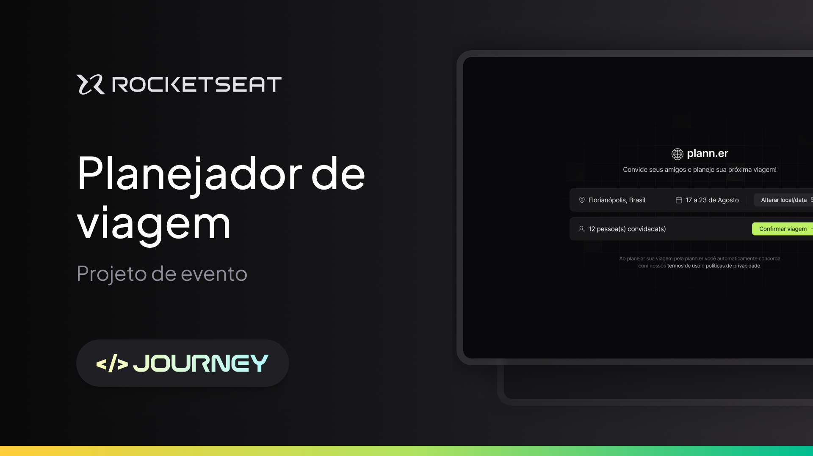

<h3 align="center">Nlw Journey - Trilha React</h3>
<div align="center">
    
</div>

---
## :art: Layout
[Figma](https://www.figma.com/community/file/1392276515495389646)

---
## :gear: Techs
- [ReactJS](https://reactjs.org/)
- [ReactRouter](https://reactrouter.com/)
- [Axios](https://axios-http.com/)
- [DayPicker](https://daypicker.dev/)

---
## :book: Features


---
## :desktop_computer: Como usar
- 1° Para o projeto funcionar é necessário uma API/Backend para receber as requisições, que foi desenvolvida em outra trilha:


    - [Backend - Trilha NodeJS](https://github.com/rocketseat-education/nlw-journey-nodejs)

- 2° Crie um arquivo .env.local e copie e cole as variáveis presentes no arquivo .env.example.

- 3° Depois disso, abra o diretório com o projeto acima no seu terminal e digite os dois comandos abaixo:

```
    npm install
```
- Para instalar as dependências do projeto e o abaixo para rodar o projeto

```
    npm run dev
```

- Logo após rodar o backend, basta abrir outra aba com o projeto Frontend e digite os dois comandos acima, novamente.

---
## :spiral_notepad: License
Arquivos sob a licença [MIT](https://github.com/lucasgomesgp) criado por Lucas Gomes.
